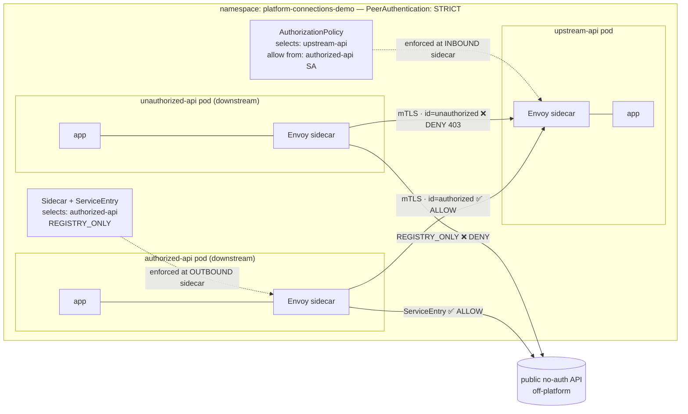

# platform-connections-demo

Test apps for my homelab's platform-connections mesh POC — See [docs/platform-connections](https://github.com/cujarrett/homelab/blob/main/docs/platform-connections.md) in the homelab repo.

📊 **[The visual story](docs/connections.html)** — open in a browser. The five gates a call passes through, what layer each sits at, the Istio object that enforces it, and where fine-grained auth plugs in. Grug at a glance, clickable for the YAML.

One repo, not one-per-app, because these are throwaway POC apps with no independent release cadence — delete this whole repo once the mesh decision is validated and the real `Connection` platform work begins.

| App | Role |
|---|---|
| [`api/`](api/) | Protected upstream service (`GET /api/v1/data`), deployed as `upstream-api`. |
| [`downstream/`](downstream/) | Calls `upstream-api` internally, plus a public no-auth off-platform API. Deployed twice — as `authorized-api` and `unauthorized-api` — under different service accounts. Same image, same code; only the identity differs, which is the whole point of the mesh test. |

Each app is an independent Go module with its own `justfile` (`just ci` to lint/test/build).

## Topology & where Istio policy lands

The public API checks no identity itself — yet the mesh still controls *which workload may reach it*: `authorized-api` has the egress `ServiceEntry`, `unauthorized-api` doesn't, so `REGISTRY_ONLY` blocks it at the downstream app's own sidecar.

**Every pod = app container + injected Envoy sidecar.** All policy is enforced *by the sidecar*, never the app.

| Policy | Namespaced? | Lives in | Enforced at |
|---|---|---|---|
| `PeerAuthentication` (STRICT) | yes | the pod's namespace | each sidecar (mutual mTLS) |
| `AuthorizationPolicy` (who may call in) | yes | the **upstream's** namespace, selecting the upstream app | upstream's **inbound** sidecar |
| `Sidecar` + `ServiceEntry` (egress) | yes | the **downstream's** namespace, selecting the downstream app | downstream's **outbound** sidecar |

So yes — it's all namespaced. Inbound identity checks land on the **upstream** sidecar; egress checks land on the **downstream** sidecar. The two downstream instances are byte-identical images; only the service-account identity differs, which is the entire test.
